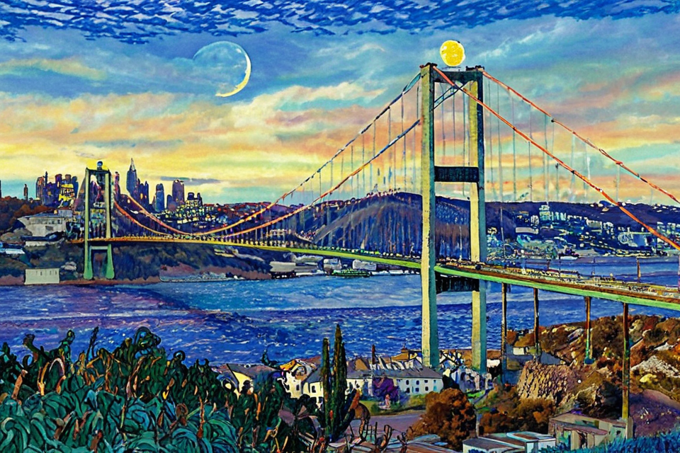

# Image-to-Image-Generation
## Overview
This project includes a basic ComfyUI workflow that transforms a given input image into a Van Gogh style image using Stable Diffusion and ControlNet.
## Prerequisites
Before running this workflow, ensure the following are installed on your local machine or cloud environment:
- **Python 3.10+**
- **ComfyUI**

## Setup Instructions
### Step 1: Install ComfyUI
Clone the ComfyUI repository and install the requirements

```bash
git clone https://github.com/comfyanonymous/ComfyUI.git
cd ComfyUI
pip install -r requirements.txt
```
### Step 2 : Install the required custom nodes
```bash
cd custom_nodes
git clone https://github.com/ltdrdata/ComfyUI-Manager.git
git clone https://github.com/Fannovel16/comfyui_controlnet_aux.git
git clone https://github.com/cubiq/ComfyUI_IPAdapter_plus.git
git clone https://github.com/cubiq/ComfyUI_essentials.git
cd ..
cd ..
```

#### Step 3: Download stable diffusion and controlnet models
-  [Juggernaut XL](https://civitai.com/models/133005?modelVersionId=288982)
-  [control-lora-depth-rank256.safetensors](https://huggingface.co/stabilityai/control-lora/tree/main/control-LoRAs-rank256)
-  [diffusion_pytorch_model.fp16.safetensors](https://huggingface.co/diffusers/controlnet-canny-sdxl-1.0-mid/resolve/main/diffusion_pytorch_model.fp16.safetensors)

### Step 4: Download the IP Adapter models and Clip Vision Models
### Step 5: Run the Comfyui
 ```bash
cd ComfyUI
python main.py
 ```
### Step 6: Load workflow in the repo
   
## Important! All steps to perform automatically:
 ```bash
cd Image-to-Image-Generation
bash setup.sh
 ```
## Example outputs

<table>
    <tr>
        <td style="text-align: center;">
            <strong>Before</strong><br>
            
        </td>
        <td style="text-align: center;">
            <strong>After</strong><br>
            
        </td>
    </tr>
   <tr>
        <td style="text-align: center;">
            
        </td>
        <td style="text-align: center;">
            
        </td>
    </tr>
     <tr>
        <td style="text-align: center;">
            
        </td>
        <td style="text-align: center;">
            
        </td>
    </tr>
 
</table>
